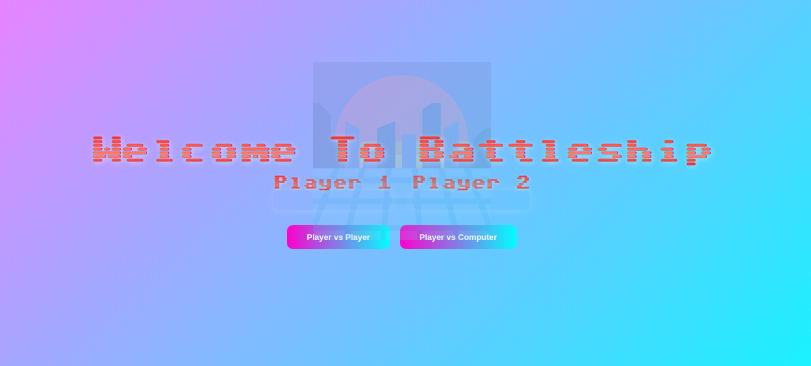
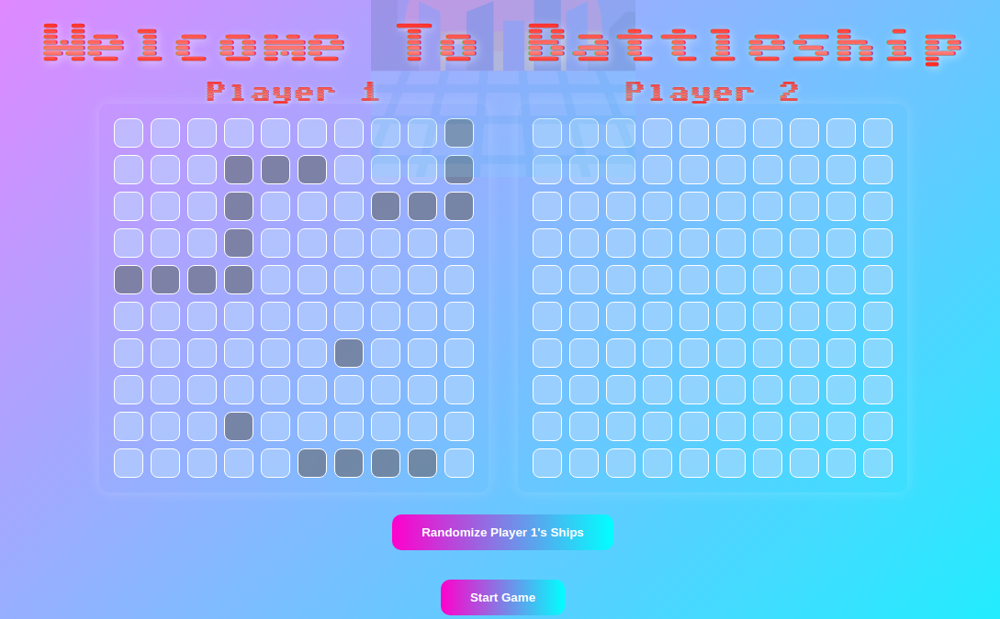

# Battleship - Vaporwave Edition 🌅🎮


Welcome to **Battleship**, a vibrant web-based version of the classic board game reimagined with a unique **Vaporwave** aesthetic! Challenge your friends or take on the computer in this retro-styled game filled with neon colors and chill vibes.

## Features
- **Player vs Player** mode for face-to-face battles.
- **Player vs Computer** mode for solo gaming.
- Random ship placement for quick games.
- Responsive design for play on any device.

## Technologies Used
- **HTML5**: Structure and layout of the game.
- **CSS3**: Styling with a vaporwave theme, including animations and transitions.
- **JavaScript**: Game logic and interactivity.
- **Jest**: Testing framework for ensuring code reliability.


## Getting Started

### Prerequisites
- [Node.js](https://nodejs.org/) (version 14 or later)
- npm (Node package manager)

### Installation
1. **Clone the repository**:
   ```bash
   git clone https://github.com/Ajbakaric/project-battleship.git

2. **Navigate to the project directory**:
   ```bash
   cd project-battleship
   
3. **Install dependencies**: Make sure you have Node.js installed. Then, install the project dependencies using npm:
   ```bash
   npm install
   ```
4. **Build the project**: Use Webpack to bundle the project files:
   ```bash
   npm run build
   ```
5. **Open the dist/index.html file in a web browser**: The bundled game is ready to be played in any modern browser.

## Live Demo

Check out the live version of the Battleship game here:

[Play Battleship Live on Netlify](https://<your-netlify-site>.netlify.app)

## Screenshots



## Enjoy playing Battleship!

